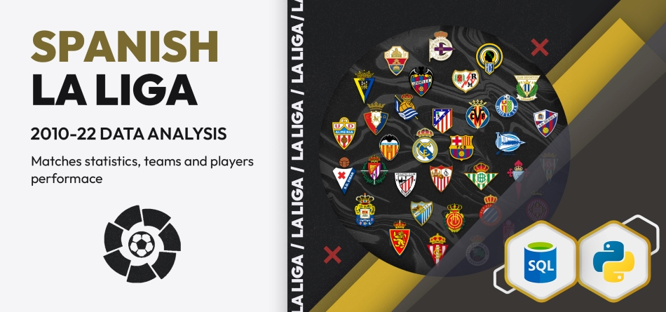

# Analyzing La Liga Data (top Spanish football league)

La Liga, also known as the Primera División, is Spain top professional football league. It consists of 20 teams that compete against each other throughout the season.
Since its beginning in 1929, 62 have competed in La Liga, while only nine teams won the title. Real Madrid holds the record with 35 titles, and Barcelona comes second with 27 titles. La Liga always had an important place on the European football map. The last years were no exception. La Liga led the UEFA's league coefficient ranking every season from 2012/2013 to 2019/2020 (I see you, Premier League :smirk: ).

In this data analysis, we examine matches and statistics data of La Liga, starting season 2010/2011, the season the rivalry between Barcelona and Real Madrid took another level with José Mourinho coming onto Real Madrid's board to finally give a real start to Florentino Perez's second "Galacticos Era".
We will be looking at various aspects of the data, with a focus on the teams' and players' performance. Our analysis may help identify trends and patterns to better understand the features and particularity of La Liga and gain insight into football in general.

We used several data analysis techniques, such as statistical analysis and visualization, to explore the data and draw conclusions. The motivation for this project is to showcase the main phases of a data science project, starting with framing the problem, collecting and preparing data, exploring data, analyzing data and building models, to finishing with evaluating and deploying models.
 

## Project workflow

The general workflow of the project is as follows:

1. Scraping players' information and market value from (transfermarkt):
Scraping refers to the process of extracting data from a website using a program or script. In our case, we wrote a script using Scrapy to do the job. Scrapy is a fast and powerful web-crawling framework written in Python. We then stored the extracted data in a JSON file for easy access when needed.

2. Downloading matches and statistics data from (fbref):
fbref is a website that provides a wealth of statistical data on football (soccer) matches, teams, and players. The website allows downloading the data in several formats. We downloaded the data we needed in CSV files.

    Note: scraping matches and statistics data from the website or other websites may be a better alternative as it gives more control over data and fewer inconsistencies when combining data from different sources. Yet, we have chosen to download the data to simulate real situations where data come from different streams and sources and thus need a load of work in cleaning and integration.

3. Cleaning and exploring data:
This task involves removing or correcting any errors or inconsistencies in the data, such as missing values, duplicates, and outliers. It also involves transforming the data in a way that makes it more suitable for analysis.
By exploring the data we mean: an initial analysis of the data to get a better understanding of its characteristics and patterns. This can include summarizing the data using statistical measures, visualizing the data using basic plots and charts, and identifying trends and relationships.

4. Storing data in a PostgreSQL database:
We stored the data in a PostgreSQL database for easy access and analysis. Postgresql is a popular open-source database management system that is well-suited for storing and querying large datasets. Storing the data in a SQL database allows more efficient storage with more consistency and less redundancy, it also allows fast retrieval and efficient manipulation of the data.

5. Analyzing data:
We used SQL queries to extract specific subsets of data for questions we are trying to answer. We also performed statistical analyses and used visualizations to discover patterns in our data.

6. Creating a simple web application to interact with data:
We created an application for regression analysis using Streamlit. Streamlit is an open-source app framework dedicated to data science that enables the swift creation of data analysis web apps.

Let our tour begin!!
Please head for La_Liga_Analysis notebook, you can [click here](https://github.com/BreathingData/La_Liga_Analysis/blob/master/La_Liga.ipynb)
